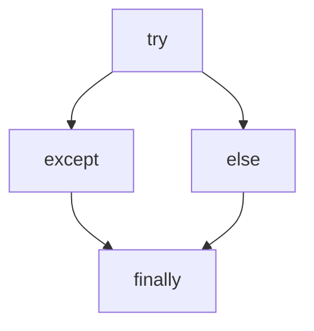

# print输出函数

`print()`函数可以输出数字，字符串，含有运算符的表达式

```python
#输出字符串
print('hello world')    # hello world
print("hello world")    # hello world

#含有运算符的表达式
print(5 + 1)    # 6

#将数据输出文件中 1、所指定的盘符存在 2、使用file = fp
fp = open('D:/text.txt','a+')   # a+ 如果文件不存在就创建，存在就在文件内容的后面继续追加
print('hello world', file = fp)
fp.close()

# 不换行输出 （输出的内容在一行）
print('Hello','World','Python') #   Hello World Python
```

# 转义字符

## 转义字符的应用

在交互式解释器中，输出的字符串用引号引起来，特殊字符用反斜杠\转义

| 转义字符        | 描述                                        |
| :-------------- | ------------------------------------------- |
| `\`（在行尾时） | 续行符                                      |
| `\\`            | 反斜杠符号                                  |
| `\'`            | 单引号                                      |
| `\"`            | 双引号                                      |
| `\a`            | 响铃                                        |
| `\b`            | 退格（BackSpace）                           |
| `\000`          | 空                                          |
| `\n`            | 换行                                        |
| `\w`            | 纵向制表符                                  |
| `\t`            | 横向制表符                                  |
| `\r`            | 回车                                        |
| `\f`            | 换页                                        |
| `\o`            | 八进制数，例如：\o12代表换行，其中 o 是字母 |
| `\x`            | 十六进制数，例如：\x0a代表换行              |
| `\other`        | 其它的字符以普通格式输出                    |

```python
# 换行
print('Hello wo\nrld')

# 单引号 双引号
print('Hello \'world\'')    # Hello 'world'
print('Hello \"world\"')    # Hello "world"

# 回车
print('Hello wo\rrld')  # rld

# 退格
print('Hello\b world')  # hell world
```

## 原字符

在字符串之前加上r，或R，可以不让字符串中的转义字符起作用

```python
#  原字符
print(r"hello wo\nrld")		#输出结果 hello wo\nrld
print(R"hello wo\nrld")		#输出结果 hello wo\nrld
```

# 标识符和保留字

## 标识符

变量、函数、类、模块和其它对象的其的名字就叫标识符
> **起变量名规则**
>
> 1. 可以是字母、数字、下划线组成
> 2. 不能以数字开头
> 3. 不能是Python的保留字
> 4. Python严格区分大小写

## 保留字

保留字赋予了特定的意义，任何对象起名字都不能用

```python
# 查询Python的保留字 keyword库
import keyword
print(keyword.kwlist)	#输出Python的保留字
```

# 变量定义和使用

## 定义

变量由三部分组成

```python
a = '123'
print('标识：',id(a))
print('类型：'type(a))
print('值：',a)
```

> 1. 标识：标识对象所存储的内存地址，使用内置函数id(obj)来获取
> 2. 类型：表示的是对象的数据类型，使用内置函数type(obj)来获取
> 3. 值：表示对象所存储的具体数据，使用print(obj)可以将值进行打印输出

## 赋值

变量的多次赋值

> 当多次赋值之后，变量名会指向新的空间

```python
# 变量的多次赋值
num = 123
print(num)  # 123
# 再赋值同一个变量会覆盖原有的值
num = 789
print(num)  # 789
```

单个变量赋值

```python
# 单个变量赋值
num1 = 5
num1 *= 3
print(num1) # 15

num2 = 2
num2 **= 3
print(num2) # 8
```

多个变量赋不同的值

```python
#多个变量赋不同的值
a, b, c = 10, 20, 30
print(a, b, c)
```

多个变量赋相同的值

```python
#多个变量赋相同的值
a = b = c = 5
print(a, b, c)
```

# 数据类型

## 整数类型

**整数类型**：英文为integer，简写为int，可以表示正数，负数和零

```python
#整数类型
num = 1
print(type(num))    # int类型
```

整数的不同进制表示方式

```python
# 二进制0b
print(0b100)    # 十进制 4
# 八进制0o
print(0o100)    # 十进制 64
# 十六进制0x
print(0x100)    # 十进制 256
```

> - 十进制是默认的进制
> - 二进制以 0b 开头
> - 八进制以 0o 开头
> - 十六进制以 0x 开头

数字分隔符

> **使用下划线_作为数字（包括整数和小数）的分隔符。通常每隔三个数字添加一个下划线，类似于英文数字中的逗号。下划线不会影响数字本身的值**

```python
#数字分隔符
num = 1_234_567
print(num)  #1234567
```

## 浮点类型

浮点数由整数部分和小数部分组成

```python
# 浮点类型
num = 3.14
print(type(num))    # float类型
```

浮点数存储的不精确性

> 使用浮点数进行计算时，可能会出现小数位数不确定的情况

```python
# 浮点数存储的不精确性
print(1.1 + 2.2)    # 3.3000000000000003
print(1.2 + 2.1)    # 3.3

# 解决方案  导入decimal
from decimal import Decimal
print(Decimal('1.1') + Decimal('2.2'))  # 3.3
```

## 布尔类型

- 用来表示真或假的值
- True表示真，False表示假
- 布尔值可以转化为整数

```python
#布尔类型
# True 为 1 （真），False 为 0 （假）
print(True + 1)     # 2
print(False + 1)    # 1
print(type(True))   # bool类型
```

对象的布尔值：

> - Python一切皆对象，所有对象都有一个布尔值
> - 获取对象的布尔值：使用内置函数bool()
> - **以下对象的布尔值为False：**
>   1. False
>   2. 数值 0
>   3. None
>   4. 空字符串
>   5. 空列表
>   6. 空元组
>   7. 空字典
>   8. 空集合

## 字符串类型

> 1. 字符串又称为不可变的字符序列
>
> 2. 可以使用单引号`' '`、双引号`" "`、三引号`''' ''' `或`""" """ `来定义
> 3. 单引号和双引号定义的字符串必须再一行
> 4. 三引号定义的字符串可以分布再连续的多行

```python
# 字符串类型
str1 = 'Hello world'
print(str1)
print(type("Hello world"))  #str类型

str2 = '''Hello world'''
str3 = """Hello 
world"""    
print(str2)
print(str3)		# 输出结果会换行
```

# 数据类型转换

| 函数名  | 作用                     | 说明                                                         |
| ------- | ------------------------ | ------------------------------------------------------------ |
| str()   | 将其他数据类型转成字符串 | 也可用引号转换                                               |
| int()   | 将其他数据类型转成整数   | 文字类和小数类字符串，无法转化整数<br>浮点数转化成整数，抹零取整 |
| float() | 将其他数据类型转成浮点数 | 文字类无法转成整数<br>整数转成浮点数，末尾为`.0`             |

## str

```python
# str()
name = '张三'
age = 18

print(type(name), type(age))    # name为str类型，age为int类型，类型不相同

# 可以使用 str() 转换为 str类型
print('我叫' + name + ',' ,'今年'+ str(age) + '岁')  # str类型和int类型连接时会报错，需要转换类型
print(type(str(age)))   # 转换 str类型
```

## int

```python
# int()
num = '123'

print(type(int(num)))   # int类型
str = '人生苦短，我学Python'
#print(int(str))    文字无法转换为整数

fo = 3.14
print(int(3.14))    # 3 浮点数转换为整数会抹零取整
#print(int('3.0'))   整数 转换 字符串中数字包含小数点将会报错
```

## float

```python
# float()
num = 3
print(float(num)) # 3.0 float类型
```

# 注释

在代码中对代码的功能进行解释说明的标注性文字，可以提高代码的可读性

注释的内容会被Python解释器忽略

通常包括三种类型的注释：

> 1. 单行注释：以`#`开头，直到换行结束
>
> 2. 多行注释：并没有单独的多行注释标记，将一对三引号之间的代码称为多行注释`''' '''`
>
> 3. 中文编码声明注释：在文件开头加上中文声明注释，用以指定源码文件的编码格式
>
>    ```python
>    #coding:gbk
>    ```

# input函数

> 作用：接收来自用户的输入
>
> 返回值类型：输入值的类型为str
>
> 值的存储：使用 " = " 对输入的值进行存储

```python
a = int(input('请输入一个整数：'))
b = int(input('请再输入一个整数：'))
print(a + b)
```

# 运算符

## 算术运算符

| 操作符 | 说明                                       |
| ------ | ------------------------------------------ |
| +      | 加：两个对象相加                           |
| -      | 减：一个数减去另外一个数                   |
| *      | 乘：两数相乘或返回一个被重复若干次的字符串 |
| /      | 除：两个数相除                             |
| %      | 取模：返回两个数相除的余数                 |
| **     | 幂：返回某一个数的若干幂                   |
| //     | 取整：返回两数相除后所得商的整数部分       |

```python
a = 4
b = 2
print(a + b)	# 6
print(a - b)	# 2
print(a * b)	# 8
print(a / b)	# 2.0
print(a % b)	# 0
print(a ** b)	# 16
print(a // b)	# 2
```

## 赋值运算符

| 赋值运算符 | 说明                  |
| ---------- | --------------------- |
| =          | 直接赋值              |
| +=、-=     | 加、减一个数 后再赋值 |
| *=、/=、%= | 乘、除、取模 后再赋值 |
| **=、//=   | 幂、取整 后再赋值     |

## 比较运算符

概念：比较运算符(关系运算符) 是**两个数据进行比较时所使用的运算符**，比较运算后，会**返回一个布尔值**(True/False) 作为比较运算的结果

| 运算符 | 说明                           |
| ------ | ------------------------------ |
| ==     | 判断是否等于                   |
| !=     | 判断是否不等于                 |
| >      | 判断是否大于                   |
| <      | 判断是否小于                   |
| >=     | 判断是否大于等于               |
| <=     | 判断是否小于等于               |
| is     | 判断两个对象存储单元是否相同   |
| is not | 判断两个对象存储单元是否不相同 |

```python
a = 5
b = 8
print(a == 5) # True
print(a != 5) # False
print(a > 7)  # False
print(a < 9)  # True
print(a >= 4)  # True
print(a <= 2)  # False
print(a is b)  # False
print(a is not b)   # True
```

## 逻辑运算符（布尔运算符）

Python总共有三个逻辑运算符：`and`、`or`和`not`

表列举了布尔运算的结果，优先级为升序：

| 运算 | 表达式    | 说明                                       |
| ---- | --------- | ------------------------------------------ |
| 与   | `x and y` | 只要有一个为False则为False，全True则为True |
| 或   | `x or y`  | 只要有一个为True则为True，全False则为False |
| 非   | `not x`   | x为False则为True，否则为False              |

```python
a, b = 0, 1
# and：全部Ture则为Ture，否则为False
print(a == 0 and b == 2)    # False

# or：只要有一个True则为Ture
print(a == 2 or b == 1)     # True

# not：如为Ture就为False，如为False就为True（取反）
print(not a)    # True
print(not b)    # False
```

> - and也是种“短路运算符”，只有当第一个为True时才去验证第二个。即：两个变量都为True时结果才为True
> - or是一种“短路运算符”，只有当第一个为False时才去验证第二个。即：两个变量只要有一个为True则为True
> -  not的优先级比非布尔运算符底，所以not a == b解释为not (a == b)，并且a == not b是语法错误

## 身份运算符

身份运算符用于比较对象，不是比较它们是否相等，但如果它们实际上是同一个对象，则具有相同的内存位置

| 运算符 | 说明                                   |
| ------ | -------------------------------------- |
| is     | 如果两个变量是同一对象，则返回True     |
| is not | 如果两个变量不是同一个对象，则返回True |

```python
a, b = 5, 9
print(a is b)   # False
print(a is not b)   # True
```

## 成员运算符

员资格运算符用于测试序列是否在对象中出现

| 运算符 | 说明                                         |
| ------ | -------------------------------------------- |
| in     | 如果对象中存在具有指定值的序列，则返回True   |
| not in | 如果对象中不存在具有指定值的序列，则返回True |

```python
lis1 = [1, 2, 3, 4, 5, 6, 7]
lis2 = ['A', 'B', 'C', 'D', 'E', 'F', 'G']
print(5 in lis1)    # True
print('A' not in lis2)  # False
```

## 位运算符

位运算符用于比较（二进制）数字

| 符号 | 描述 | 运算规则                                                     |
| ---- | ---- | ------------------------------------------------------------ |
| &    | 与   | 两个位都为1时，结果才为1                                     |
| \|   | 或   | 两个位都为0时，结果才为0                                     |
| ^    | 异   | 两个位相同为0，相异为1                                       |
| ~    | 取反 | 0变1，1变0                                                   |
| <<   | 左移 | 各二进位全部左移若干位，高位丢弃，低位补0                    |
| >>   | 右移 | 各二进位全部右移若干位，对无符号数，高位补0，有符号数，各编译器处理方法不一样，有的补符号位（算术右移），有的补0（逻辑右移） |

### 按位与运算符（&）

**定义**：参加运算的两个数据，按二进制位进行"与"运算

运算规则：

```
0&0=0 
0&1=0
1&0=0 
1&1=1
```

> 两位同时为1，结果才为1，否则结果为0
>
> 注意：负数按补码形式参加按位与运算

```python
print(3&5)	# 1 
#即 0000 0011& 0000 0101 = 0000 0001，因此 3&5 的值得1。
```

### 按位或运算符（|）

**定义**：参加运算的两个对象，按二进制位进行"或"运算

运算规则：

```python
0|0=0 
0|1=1 
1|0=1 
1|1=1
```

> 参加运算的两个对象只要有一个为1，其值为1
>
> 注意：负数按补码形式参加按位或运算

```python
print(3|5)	# 7 
# 0000 0011| 0000 0101 = 0000 0111，因此，3|5的值得7
```

### 异或运算符（^）

**定义**：参加运算的两个数据，按二进制位进行"异或"运算

运算规则：

```python
0^0=0 
0^1=1 
1^0=1 
1^1=0
```

> 参加运算的两个对象，如果两个相应位相同为0，相异为1
>
> 异或的几条性质：
>
> 1、交换律
>
> 2、结合律 (a^b)^c == a^(b^c)
>
> 3、对于任何数x，都有 x^x=0，x^0=x
>
> 4、自反性: a^b^b=a^0=a;

### 取反运算符 (~)

**定义**：参加运算的一个数据，按二进制进行"取反"运算

运算规则：

```python
~1=0 
~0=1
```

> 对一个二进制数按位取反，即将0变1，1变0

### 左移运算符（<<）

**定义**：将一个运算对象的各二进制位全部左移若干位（左边的二进制位丢弃，右边补0）

```python
a=1010 1110
a = a<< 2 
# 将a的二进制位左移2位、右补0，即得a=1011 1000
```

> 若左移时舍弃的高位不包含1，则每左移一位，相当于该数乘以2

### 右移运算符（>>）

**定义**：将一个数的各二进制位全部右移若干位，正数左补0，负数左补1，右边丢弃

```python
a=a>>2 
# 将a的二进制位右移2位，左补0 或者 左补1得看被移数是正还是负
```

> 操作数每右移一位，相当于该数除以2

## 复合赋值位运算符

| 运算符 | 说明 |
| ------ | ---- |
| &=     |      |
| \|=    |      |
| >>=    |      |
| <<=    |      |
| ^=     |      |

# 流程控制

## if 语句

语法结构

```python
if 条件表达式:
    条件执行体
```

```python
n = 100
if n >= 100:    # 条件为True，则执行
    n = n - 40
    print(n)    # 60
```

## if...else 语句

语法结构

```python
if 条件表达式:
    条件执行体1
else:
    条件执行体2
```

```python
n = 3
if n % 2 == 0:
    print('是偶数')
else:
    print('是奇数')
```

## if...elif...else 语句

语法结构

```python
if 条件表达式:
    条件执行体1
elif 条件表达式2:
    条件执行体2
elif 条件表达式N:
    条件执行体N
[else:]
    条件执行体N+1
```

```python
n = 72
if n >= 90 and n <= 100:
    print('A')
elif n >= 80 and n <= 89:
    print('B')
elif n >= 70 and n <= 79:
    print('C')
elif n >= 60 and n <= 69:
    print('D')
elif n >= 0 and n <= 59:
    print('E')
else:
    print('无效')
```

## 嵌套if

语法结构

```python
if 条件表达式1:
    if 内层条件表达式:
        内层条件执行体1
    else:
    	内层条件执行体2
else:
    条件执行体
```

```python
a = 1
b = 10
if a == 1:
    if b > 20:
        print('A')
    elif b > 30:
        print('B')
    else:
        print('C')
else:
    print('无效')
```

## 条件表达式

```python
num1 = 10
num2 = 5
# 使用条件表达式比较
print(str(num1) +'大于或等于'+ str(num2) if num1 >= num2 else str(num1) +'小于'+ str(num2))
```

# pass语句

pass语句：占位符，（可以先搭建语法结构，没想好怎么写可以用占位符）

```python
# pass语句
n = 15
if n == 15:
    pass    # pass什么都不做
else:
    print(n + 1)
```

> 可以使用的语句：
>
> - if语句的条件执行体
>
> - for-in语句的循环体
>
> - 定义函数时的函数体

# range内置函数

range()函数用于生成一个整数序列

**创建range对象的三种方式**：

> `range(stop)`：创建一个[0, stop]之间的整数序列，步长为1
>
> `range(start, stop)`：创建一个[start, stop]之间的整数序列，步长为1
>
> `range(start, stop, step)`：创建一个[start, stop]之间的整数序列，步长为step

```python
# range(stop)
a = range(10)
print(a)    # range(0, 10)
print(list(a))  # [0, 1, 2, 3, 4, 5, 6, 7, 8, 9]

# range(start, stop)
b = range(5, 11)
print(b)    # range(5, 11)
print(list(b))  # [5, 6, 7, 8, 9, 10]

# range(start, stop, step)
c = range(1, 10, 2)
print(c)    # range(1, 10, 2)   步长为 2
print(list(c))  # [1, 3, 5, 7, 9]
```

> 返回值是一个迭代器对象
>
> range不取最后一个数

**in 与 not in 可以判断整数序列是否存在（不存在）指定的整数**

```python
# in 与 not in 可以判断整数序列是否存在（不存在）指定的整数
num = range(1, 10, 3)
print(list(num))    # [1, 4, 7]
print(9 in num)     # False 9 不在当前num这个整数序列中
print(4 in num)     # True 4 在当前num这个整数序列中

print(5 not in num)     # True
print(7 not in num)     # False
```

# 循环

## while

语法结构

```python
while 条件表达式:
    条件执行体（循环体）
```

```python
# while循环
a = 0
while a < 10:   # 判断条件表达式
    print(a)    # 执行条件体
    a += 1

# 1 到 100 的偶数和
num = 1
con = 0
while num <= 100:
    if num % 2 == 0:
        con += num
    num += 1
print(con)
```

## for...in

语法结构

```python
for 自定义的变量 in 可迭代对象:
    循环体
```

循环体内不需要访问自定义变量，可以将自定义变量替换为下划线

in表达从（字符串、序列等）中依次取值，又称为遍历

for-in遍历的对象必须是可迭代对象

```python
# for...in循环
for str in 'Python':
    print(str,end='') # end：不换行输出

# range() 产生一个整数序列，也是一个迭代对象
for i in range(10):
    print(i)

# 如果在循环体中不需要自定义变量，可将自定义变量写为“ _ ”
for _ in range(5):
    print('Hello world')


# 1 到 100 之间的偶数和
num = 0
for i in range(1, 101):
    if i % 2 == 0:
        num += i
print(num)
```

## break语句

break用于结束循环

```python
# break语句
for i in range(10):
    if i == 4:  # 循环到 4 结束循环
        break
    print(i)

a = 2
b = 7
while a < 10:
    if a > b:   # 循环到特定的条件结束循环
        break
    else:
        a += 1
    print(a)
```

## continue语句

continue用于结束当前循环

```python
# continue语句
for i in range(1, 101):
    if i % 2 != 0:  # 循环到不是偶数则结束当前循环
        continue
    print(i)


a = 0
while a <= 100:
    a += 1
    if a % 2 != 0:
        continue
    print(a)
```

## 嵌套循环

循环结构中又嵌套了另外的循环结构，其中内层循环作为外层循环的循环体执行

```python
# 嵌套循环
for i in range(1,10):
    for j in range(1, i + 1):
        print('*', end='')
    print()
```

# else语句

else语句的主要使用：

```mermaid
graph TD;
    else语句-->if...else...->if条件表达式不成立时执行else;;
    else语句-->while...else...->没有遇到break时执行else;
    else语句-->for...else...->没有遇到break时执行else;
```

```python
# else 语句
for i in range(3):
    password = int(input('请输入密码：'))
    if password == 12345:
        print('密码正确')
        break
    else:
        print('密码错误，请重新输入！')
else:
    print('对不起，三次密码均输入错误！')


a = 0
while a < 3:
    password = int(input('请输入密码：'))
    if password == 12345:
        print('密码正确')
        break
    else:
        print('密码错误，请重新输入！')
        a += 1
else:
    print('对不起，三次密码均输入错误！')
```

# 列表

## 创建列表

1. 使用中括号`[]`创建
2. 调用内置函数list()

列表需要使用中括号[ ]，元素之间使用英文的逗号进行分隔

```python
# list列表
# 使用[]创建列表
lis1 = ['Hello', 2, '123', 10]

# 使用内置函数list()创建列表
lis2 = list(['World', 'abc', 15])


```

列表的特点

> 1. 列表元素按顺序有序排序
>
> 2. 索引映射唯一数据
>
>    ```python
>    # 索引号从 0 开始
>    # 索引		 0		 1    2   3      4		  5
>    lis = list(['Hello', 'a', 123, 'b', 'Hello', '456'])
>    # 索引		-6		 -5  -4   -3     -2		 -1
>    ```
>
> 3. 列表可以存储重复数据
>
> 4. 任意数据类型混存
>
> 5. 根据需要动态分配和回收内存

## 获取列表中单个元素

> 1. 正向索引0到N-1：`lst[0]`
> 2. 逆向索引-N到-1：`lst[-N]`
> 3. 指定索引不存在，抛出IndexError

```python
lis = ['Hello', 2, '123', 10]
print(lis[-3])     # 2 通过索引查找列表元素
print(lis[1])  # 2
```

## 获取指定元素的索引

> `index()`：
>
> 1. 如查列表中存在N个相同元素，只返回相同元素元素中的第一个元素的索引
> 2. 如果查询的元素在列表中不存在，则会抛出ValueError
> 3. 还可以在指定的start和stop之间进行查找

```python
lis = list(['Hello', 'a', 123, 'b', 'Hello', '456'])
print(lis.index(123))   # 2
print(lis.index('Hello'))   # 0 存在相同元素则返回相同元素的第一个元素索引
print(lis.index('Hello', 1, 5)) # 4 查询指定索引号从1 到 5（不包括5）的元素
```

## 切片

语法格式

```python
列表名[start:stop:step]
```

```python
# 列表切片
lis = list([10, 20, 30, 40 ,50 ,60, 70 ,80])
# 默认步长为 1
print(lis[1:6])     # [20, 30, 40, 50, 60]
print(lis[1:6:])     # [20, 30, 40, 50, 60]

# start = 1，stop = 6，step = 2
print(lis[1:6:2])   # [20, 40, 60]

# start默认，stop = 6，step = 2
print(lis[:6:2])    # [10, 30, 50]

# start = 1，stop默认，step = 2
print(lis[1::2])    # [20, 40, 60, 80]

# start默认，stop默认，step = 2
print(lis[::2])     # [10, 30, 50, 70]

# start = 6，stop = 0，step = -1
print(lis[6:0:-1])  # [70, 60, 50, 40, 30, 20]

# start = 6，stop = 0， step = 负数
print(lis[6::-1])  # [70, 60, 50, 40, 30, 20, 10]
print(lis[6::-3])  # [70, 40, 10]
```

## 判断指定元素在列表中是否存在

```python
# 判断指定元素在列表中是否存在
a = list(['Hello', 123, 'world', 'abc', 555])
print('abc' in a)   # True
print('123' in a)   # False
print('Hello' not in a) # False
print('Python' not in a)    # True
```

## 列表遍历

```python
# 列表遍历
j = list(['Hello', 123, 'world', 'abc', 555])
for i in j:
    print(i)
```

## 添加元素

| 方法/其它        | 说明                             |
| ---------------- | -------------------------------- |
| append(值)       | 在列表的末尾添加一个元素         |
| extend(值)       | 在列表的末尾至少添加一个元素     |
| insert(索引, 值) | 在列表的任意位置添加一个元素     |
| 切片             | 在列表的任意位置添加至少一个元素 |

```python
#  增加列表元素
lis1 = ['Hello', 'abc', 123, 'world']
lis1.append('555')   # 在列表的末尾添加一个元素
print(lis1)  # ['Hello', 'abc', 123, 'world', '555']

lis2 = ['A', 'B']
#lis1.append(lis2)  使用append()会将lis2作为一个元素添加到列表末尾
#print(lis1) # ['Hello', 'abc', 123, 'world', '555', ['A', 'B']]

lis1.extend(lis2) # 在列表的至少添加一个元素
print(lis1) #['Hello', 'abc', 123, 'world', '555', 'A', 'B']


# 在任意的位置添加元素
a = [10, 20, 30, 40, 50, 60, 70]
a.insert(1, 90) # 在索引为 1 的位置添加元素
print(a)    # [10, 90, 20, 30, 40, 50, 60, 70]

# 在任意位置上添加N多个元素
str1 = ['A', 'B', 'C', 'D', 'E', 'F', 'G']
str2 = [1, 2, 3, 4, 5, 6, 7, 8, 9]
str1[2:] = str2     # 将索引为2（不包括2）之后的元素切掉，没切掉的元素添加到str2
print(str1) # ['A', 'B', 1, 2, 3, 4, 5, 6, 7, 8, 9]
```

## 删除元素

| 方法/其它 | 说明                                                         |
| --------- | ------------------------------------------------------------ |
| remove()  | 一次删除一个元素<br>重复元素只删除第一个<br>元素不存在抛出ValueError |
| pop()     | 删除一个指定索引位置上的位置<br>不指定索引，删除列表中最后一个元素<br>指定索引不存在抛出IndexError |
| 切片      | 一次至少删除一个元素                                         |
| clear()   | 清空列表                                                     |
| del       | 删除列表                                                     |

```python
# 删除列表元素
# remove()
lis1 = ['abc', 'Hello', 123, 'world', 'Python','abc']
lis1.remove('abc')   # 相同元素只删除第一个
lis1.remove(123)
print(lis1)  # ['Hello', 'world', 'Python', 'abc']

# pop()
lis2 = [10, 20, 30, 40, 50, 60, 70, 80]
lis2.pop(3) # 删除索引为 3 的元素
lis2.pop()  # 不指定默认删除最后一个元素
print(lis2) # [10, 20, 30, 50, 60, 70]

# 切片
a = [1, 2, 3, 4, 5, 6, 7]
b = a[1:3]
a[1:5] = []
print(b)    # [2, 3]
print(a)    # [1, 6, 7]

# clear()清除列表
A = ['a', 'b', 'c', 'd', 'e']
A.clear()
print(A)    # []

#del 删除列表
B = [10, 20, 30, 40 ,50, 60]
del B
print(B)    # NameError: name 'B' is not defined
```

## 修改元素

为指定索引的元素赋予一个新值

为指定的切片赋予一个新值 

```python
# 修改列表元素
lis = [10, 20, 30, 40, 50, 60 ,70]
# 一次修改一个值
lis[3] = 100    # 修改索引为 3 的值
print(lis)  # [10, 20, 30, 100, 50, 60, 70]

# 利用切片修改多个值
lis[1:4] = [200, 300, 400]
print(lis)
```

## 元素排序

调用`sort()方法`，列表中的所有元素默认按照从小到大的顺序进行排序，可以指定`reverse=True`，进行降序排序

调用内置函数`sorted()`，可以指定`reverse=True`，进行降序排序，原列表不发生改变

```python
# 列表元素的排序
# 调用sort()方法
lis1 = [1, 2, 3, 4, 5, 6, 7, 8, 9]
lis1.sort()  # 默认升序
lis1.sort(reverse=True)  # reverse=True 表示降序排序，reverse=False 表示升序序排序
print(lis1) # [9, 8, 7, 6, 5, 4, 3, 2, 1]

# 使用内置函数sorted()
lis2 = [10, 20, 30, 40, 50, 60, 70, 80]
# new_lis = sorted(lis2)    # 默认升序
new_lis = sorted(lis2, reverse=True)    # 降序排序
print(new_lis)  # [80, 70, 60, 50, 40, 30, 20, 10]
```

## 生成列表的公式

语法格式

```python
[表示列表元素的表达式 for 自定义变量 in 可迭代对象]
```

```python
# 生成列表的公式
lis1 = [i for i in range(1,11)]
print(lis1)     # [1, 2, 3, 4, 5, 6, 7, 8, 9, 10]

lis2 = [i*2 for i in range(1,11)]
print(lis2)     # [2, 4, 6, 8, 10, 12, 14, 16, 18, 20]
```

# 字典

> 1. Python内置的数据结构之一，与列表一样是一个可变序列
> 2. 字典中的所有元素都是一个key-value对，key不允许重复，value可以重复
> 3. 字典中的元素是无序的
> 4. 字典中的key必须是不可变对象
> 5. 字典也可以根据需要动态地伸缩

## 创建字典

方式：使用`{}`或`dict()`函数创建字典

```python
# 使用花括号创建字典
scores = {'张三' : 10, '李四' : 20, '王五' : 30}
# 使用内置函数dict()创建字典
dict(name = '张三', age = 55)
```

## 获取字典中的元素

使用`[]` 或`get()`获取

`[ ]`取整与使用`get()`取值的区别：

- [ ]如果字典中不存在指定的key，抛出keyError异常
- get()方法取值，如果字典中不存在字典的key，并不会抛出KeyError而是返回None，可以通过参数设置默认的value，以便指定的key不存在时返回

```python
scores = {'张三' : 10, '李四' : 20, '王五' : 30}
print(scores['张三'])     # 10
print(scores.get('王五'))     # 30
print(scores.get('陈六'))     # None
print(scores.get('赵七',60))  # 60 是查找‘赵七’所对的value不存在时，提供的一个默认值
```

## 字典的增删

新增字典元素：`字典名['键名']`

删除字典元素：`del 字典名['键名']`

```python
# 字典的增删
scores = {'张三' : 10, '李四' : 20, '王五' : 30}
# 新增字典元素    字典名['键名']
scores['Jack'] = 15
print(scores)   # {'张三': 10, '李四': 20, '王五': 30, 'Jack': 15}
# 删除字典元素    del 字典名['键名']
del scores['张三']
print(scores)   # {'李四': 20, '王五': 30, 'Jack': 15}
```

## 字典key判断

使用` in `或` not in`判断字典中指定的key

```python
# 字典key判断
scores = {'张三' : 10, '李四' : 20, '王五' : 30}

# in 指定的key在字典中存在返回True，否则返回False
print('张三' in scores)   # True
print('赵钱' in scores)   # False

# not in 指定的key在字典中不存在返回True，否则返回False
print('Jake' not in scores)     # True
print('Tom'  in scores)     # False
```

## 获取字典视图

| 方法     | 说明                      |
| -------- | ------------------------- |
| key()    | 获取字典中所有key         |
| values() | 获取字典中所有 value      |
| items()  | 获取字典中所有key,value对 |

```python
# 获取字典视图
scores = {'张三' : 10, '李四' : 20, '王五' : 30}
# 获取所有key   keys()
print(scores.keys())    # dict_keys(['张三', '李四', '王五'])
print(list(scores.keys()))    # ['张三', '李四', '王五']  将所有的key组成的视图转成列表
print(type(scores.keys()))    # <class 'dict_keys'>

# 获取所有的value    values()
print(scores.values())    # dict_values([10, 20, 30])
print(list(scores.values()))    # [10, 20, 30] 将所有的value组成的视图转成列表
print(type(scores.values()))    # <class 'dict_values'>

# 获取所有的key，value对    items()
print(scores.items())    # dict_items([('张三', 10), ('李四', 20), ('王五', 30)])
print(list(scores.items()))    # [('张三', 10), ('李四', 20), ('王五', 30)] 转换之后的列表元素是由元组组成
print(type(scores.items()))    # <class 'dict_items'>
```

## 字典的遍历

```python
# 字典的遍历
scores = {'张三' : 10, '李四' : 20, '王五' : 30}
for item in scores:
    print(item,scores[item],scores.get(item))	# 张三 10 10
												# 李四 20 20
												# 王五 30 30
```

## 字典生成式

语法格式

```python
{表示字典key的表达式 : 表示字典value的表达式 for 自定义表示key的变量, 自定义表示value的变量 in zip(可迭代对象)}
```

```python
# 字典生成式
a = ['张三', '李四', '王五']
b = [20, 30, 40]

# c = {a.upper() : b for a, b in zip(a, b)}   # upper()将所有字母大写
c = {a : b for a, b in zip(a, b)}
print(c)    # {'张三': 20, '李四': 30, '王五': 40}
```

内置函数zip()

> 用于将可迭代的对象作为参数，将对象中对应的元素打包称一个元组，然后返回由这些元组组成的列表

# 元组

## 创建元组

使用`()`或`tuple()`函数创建元组

创建只包含一个元组的元素需要使用逗号和小括号

```python
# 使用小括号创建元组
a1 = ('Python', 'Hello', 123, 'abc')
print(a1)   # ('Python', 'Hello', 123, 'abc')
print(type(a1)) # <class 'tuple'>

# 使用内置函数tuple()创建元组
a2 = tuple(('123', 'Python', 'abc'))

# 只包含一个元组的元素需要使用逗号和小括号
a3 = (20,)
```

## 元组的遍历

元组是可迭代对象，所以可以使用for...in进行遍历

```python
# 元组遍历
t = ('Python', 123, 'Hello', 'abc')
for item in t:
    print(item)
```

## 获取元组元素

使用索引获取元组元素

```python
# 获取元组元素
t = ('Python', 'abc', 123, 'Hello')
# 使用索引获取元组元素
print(t[0])		# Python
print(t[1])		# abc
print(t[2])		# 123
```

# 集合

## 创建集合

使用`{}`或`set()`函数创建集合

集合（set）是一个无序的**不重复元素**序列

```python
# 集合的创建方式
# 使用{}创建集合
a = {1, 2, 3, 4, 5, 6, 7, 7}
print(a)   # {1, 2, 3, 4, 5, 6, 7} 会把重复的元素去掉
print(type(a)) # <class 'set'>

# 使用内置函数set()创建
s = set(range(6))
print(s)    # {0, 1, 2, 3, 4, 5}

print(set([1, 2, 32, 4, 55, 5, 4]))  # {32, 1, 2, 4, 5, 55} 会去重
print(set((34, 42, 5, 67, 16, 8 ))) # {34, 67, 5, 8, 42, 16}
print(set('Python'))	# {'o', 'n', 'P', 'y', 'h', 't'}
print(set({10, 234, 300, 47, 50})) # {50, 234, 10, 300, 47}

# 注意：创建一个空集合必须用 set() 而不是 { }，因为 { } 是用来创建一个空字典
print(set())    # set()
```

## 集合的数学操作

集合中的元素**不会重复**，并且可以进行交集、并集、差集等常见的集合操作

| 方法/运算符                   | 说明                                       |
| ----------------------------- | ------------------------------------------ |
| `difference()`或`-`           | 返回两个集合的差集                         |
| `union()`或`|`                | 返回两个集合的并集                         |
| `intersection()`或`&`         | 返回两个集合的交集                         |
| `symmetric_difference()`或`^` | 返回两个集合中不重复的元素集合（对称差集） |

两个集合间的运算

```python
a = set('abracadabra')
b = set('alacazam')
print(a - b)	# {'r', 'd', 'b'}	# 差集
print(a | b)	# {'a', 'c', 'r', 'd', 'b', 'm', 'z', 'l'}	# 并集
print(a & b)	# {'a', 'c'}	# 交集
print(a ^ b)	# {'r', 'd', 'b', 'm', 'z', 'l'}	# 对称差集

# ------------------------------------------------------------------
s1 = {10, 20, 30, 40}
s2 = {20, 30, 40, 60}
# 交集
print(s1.intersection(s2))  # {40, 20, 30}
print(s1 & s2)  # intersection() 与 & 等价

# 并集
print(s1.union(s2)) # {40, 10, 20, 60, 30}
print( s1 | s2) # union() 与 | 等价

# 差集
print(s1.difference(s2))    # {10}
print(s2.difference(s1))    # {60}
print(s1 - s2)  # difference() 与 - 等价

# 对称差集
print(s1.symmetric_difference(s2))  # {10, 60}
print(s1 ^ s2)  # symmetric_difference() 与 ^ 等价
```

类似列表推导式，同样集合支持集合推导式(Set comprehension)：

```python
a = {x for x in 'abracadabra' if x not in 'abc'}
print(a)	# {'r', 'd'}
```

## 判断元素是否在集合中存在

使用` in `或` not in `判断元素是否在集合中

```python
# 判断集合的元素
s = {'Python', 123, 'abc', 'Hello'}

#  in：存在返回True，不存在返回 False
print('123' in s)   # False
print(123 in s)   # True

# not in：不存在返回True，存在返回 False
print(456 not in s)   # True
print('abc' not in s)   # False
```

## 添加元素

| 方法     | 说明             |
| -------- | ---------------- |
| add()    | 一次添加一个元素 |
| update() | 至少添加一个元素 |

```python
# 集合的元素的增删
s1 = {15, 30, 10, 60, 70}
# 调用add()，一次添加一个元素
s1.add(80)
print(s1)    # {80, 70, 10, 60, 30, 15}

s2 = {1,2,3}
# 调用update()，至少添加一个元素
s2.update({300, 200, 600})
s2.update([123, 456, 789])
s2.update((111, 222, 333))
print(s2)	# {1, 2, 3, 456, 200, 333, 789, 600, 222, 300, 111, 123}
```

## 删除元素

| 方法      | 说明                                                         |
| --------- | ------------------------------------------------------------ |
| remove()  | 一次删除一个指定索引的元素，如果指定的元素不存在抛出KeyError |
| discard() | 一次删除一个指定索引的元素，如果指定的元素不存在不抛出异常   |
| pop()     | 一次只删除一个任意元素（从左到右）                           |
| clear()   | 移除集合中的所有元素                                         |

```python
# 删除集合元素
s = {1, 2, 3, 4, 5}

# remove()  一次删除一个指定元素，如果指定的元素不存在抛出KeyError
s.remove(2)
print(s)    # {1, 3, 4, 5}

# discard()  一次删除一个指定元素，如果指定的元素不存在不抛出异常
s.discard(5)    # {1, 3, 4}
print(s)

# pop()     一次只删除一个任意元素（从左到右）
s.pop()     # {3，4}
s.pop()     # {4}
print(s)

# clear()   清空集合
s.clear()
print(s)    # set()
```

## 集合间的关系

| 方法/运算符   | 说明                           |
| ------------- | ------------------------------ |
| `== `或 `!= ` | 判断两个集合是否相等           |
| issubset()    | 一个集合是否另一个集合的子集   |
| issuperset()  | 一个集合是否是另一个集合的超集 |
| isdisjoint()  | 两个集合是否含有交集           |

```python
# 两个集合是否相等
s1 = {10, 20, 30, 40, 50}
s2 = {30, 40, 50, 60 ,70}
print(s1 == s2)     # False
print(s1 != s2)     # True

s1 = {1, 2, 3, 4, 5}
s2 = {1, 2, 3}
s3 = {1, 2, 9}
s4 = {10, 20, 30}

# 一个集合是否是另一个集合的子集
print(s2.issubset(s1))  # True
print(s3.issubset(s1))  # False

# 一个集合是否是另一个集合的超集
print(s1.issuperset(s2))    # True
print(s1.issuperset(s3))    # False

# 两个集合是否含有交集
print(s2.isdisjoint(s3))    # False
print(s2.isdisjoint(s4))    # True  没有交集为True
```

## 集合生成式

语法格式

```python
{表示集合的表达式 for 自定义变量 in 可迭代对象}
```

```python
s = { i*i for i in range(10)}
print(s)	# {0, 1, 64, 4, 36, 9, 16, 49, 81, 25}
```

## 拷贝集合

使用`copy()`方法拷贝集合

```python
s1 = {1,2,3,4,5}
s2 = s1.copy()
print(s2)   # {1,2,3,4,5}
```

# 字符串的驻留机制

字符串在Python中字符串是基本数据类型，是一个不可变的字符序列

字符串的驻留机制

> 仅保存一份相同且不可变字符串的方法，不同的值被存放在字符串的驻留池中，Python的驻留机制对相同的字符串只保留一份拷贝，后续创建相同字符串时，不会开辟新空间，而是把改的字符串的地址赋给新创建的变量
>
> ```python
> a = 'Python'
> b = "Python"
> c = '''Python'''
> ```
>
> ```mermaid
> graph TD;
> c变量-->Python
> b变量-->Python
> a变量-->Python
> ```
>
> 驻留机制的几种情况（交互模式）
>
> - 字符串的长度为0或1时
> - 符合标识的字符串
> - 字符串只在编译时进行驻留，而非运行时
> - [-5,256]之间的整数数字
>
> sys中的intern方法强制2个字符串指向同一个对象
>
> PyCharm对字符串进行了优化处理

# 字符串常用操作

## 字符串的查询

查询方法

| 方法     | 作用                                                         |
| -------- | ------------------------------------------------------------ |
| index()  | 查找子串substr第一次出现的位置（索引），如果查找的子串不存在，则抛出ValueError |
| rindex() | 查找子串substr最后一次出现的位置（索引），如果查找的子串不存在，则抛出ValueError |
| find()   | 查找子串substr第一次出现的位置（索引），如果查找的子串不存在，则返回-1 |
| rfind()  | 查找子串substr最后一次出现的位置（索引），如果查找的子串不存在，则返回-1 |

```python
str = 'Hello,Hello'
print(str.index('lo'))  # 3
print(str.rindex('lo')) # 9
print(str.find('lo'))   # 3
print(str.rfind('lo'))  # 9

#print(str.index('k'))  #ValueError: substring not found
#print(str.rindex('k')) # ValueError: substring not found
print(str.find('k'))   # -1
print(str.rfind('k'))  # -1
```

## 字符串的大小写转换

| 方法           | 作用                                                         |
| -------------- | ------------------------------------------------------------ |
| `upper()`      | 把字符串中所有字符都转成大写字母                             |
| `lower()`      | 把字符串中所有字符都转成小写字母                             |
| `swapcase()`   | 把字符串中所有大写字母转成小写字母，把所有小写字母都转成大写字母 |
| `capitalize()` | 把第一个字符转换为大写，把其余字符转换为小写                 |
| `title()`      | 把每个单词的第一个字符转换为大写，把每个单词的剩余字符转换为小写 |

```python
str = 'python'
# upper() 转成大写之后，会产生一个新的字符串对象
print(str.upper())  # PYTHON
print(id(str.upper()))
# lower() 转成小写之后，会产生一个新的字符串对象
print(str.lower())  # python
print(id(str.lower()))

str2 = 'Hello，woRld'
# swapcase()  所有大写转小写，小写转大写
print(str2.swapcase())  # hELLO，WOrLD
# title()   把每个单词的第一个字符转成大写，把每个单词其余的字符转成小写
print(str2.title()) # Hello，World
# capitalize()  把第一个字符转换为大写，把其余字符转换为小写
print(str2.capitalize())    # Hello，world
```

## 字符串内容对齐

| 方法       | 作用                  | 说明                                                         |
| ---------- | --------------------- | ------------------------------------------------------------ |
| `center()` | 居中对齐              | 第1个参数指定宽度，第2个参数指定填充符（可选，默认是空格），如果设置宽度小于实际宽度则返回原字符串 |
| `ljust()`  | 左对齐                | 第1个参数指定宽度，第2个参数指定填充符（可选，默认是空格），如果设置宽度小于实际宽度则返回原字符串 |
| `rjust`    | 右对齐                | 第1个参数指定宽度，第2个参数指定填充符（可选，默认是空格），如果设置宽度小于实际宽度则返回原字符串 |
| `zfill()`  | 右对齐，左边用 0 填充 | 该方法只接收一个参数，用于指定字符串的宽度，如果指定的宽度小于等于字符串的长度，返回字符串本身 |

```python
# 居中对齐 center()
str = 'Python'
print(str.center(20, '*'))   # *******Python*******

# 左对齐 ljust()
print(str.ljust(20, '*'))   # Python**************

# 右对齐 rjust()
print(str.rjust(20, '*'))   # **************Python

# 右对齐 zfill()
print(str.zfill(20))    # 00000000000000Python
print('-1234'.zfill(10))    # -000001234
```

## 字符串劈分

| 方法       | 说明                                                         |
| ---------- | ------------------------------------------------------------ |
| `split()`  | 从字符串的**左边**开始劈分，默认的劈分字符是空格字符串，返回的值都是一个列表 |
| `rsplit()` | 从字符串的**右边**开始劈分，默认的劈分字符是空格字符串，返回的值都是一个列表 |

> 可选参数
>
> - `sep`指定字符串的劈分符
>
> - `maxsplit`指定劈分字符串的最大劈分次数，在经过最大次劈分之后，剩余的子串会单独作为一部分

```python
str1 = 'hello world Python'
print(str1.split())  # ['hello', 'world', 'Python']
print(str1.rsplit())    # ['hello', 'world', 'Python']

str2 = 'hello|world|Python'
print(str2.split(sep='|'))  # ['hello', 'world', 'Python']
print(str2.split(sep='|', maxsplit = 1))    # ['hello', 'world|Python']

print(str2.rsplit(sep='|')) # ['hello', 'world', 'Python']
print(str2.rsplit(sep='|', maxsplit=1)) # ['hello|world', 'Python']
```

## 判断字符串的内容

| 方法             | 说明                                                         |
| ---------------- | ------------------------------------------------------------ |
| `isidentifier()` | 判断指定的字符串是否合法的标识符                             |
| `isspace()`      | 判断指定的字符串是否全部由空白字符组成（回车、换行、水平制表符） |
| `isalpha()`      | 判断指定的字符串是否全部由字母组成                           |
| `isdecimal()`    | 判断指定字符串是否全部由十进制的数字组成                     |
| `isnumeric()`    | 判断指定的字符串是否全部由数字组成                           |
| `isalnum()`      | 判断指定的字符串是否全部由字母和数字组成                     |

```python
str = 'hello,python'
# isidentifier() 判断是否合法标识符
print(str.isidentifier())   # False
print('hello'.isidentifier())   # True
print('张三_123'.isidentifier())   # True

# isspace() 判断字符是否全部由空白字符组成（回车、换行，水平制表符）
print('\t'.isspace())   # True

# isalpha() 判断字符是否由字母组成
print('Python'.isalpha())   # True
print('123'.isalpha())   # False

# isdecimal() 判断字符是否全部由十进制数字组成
print('0x123'.isdecimal())  # False
print('123'.isdecimal())  # True

# isnumeric() 判断字符是否全部由数字组成
print('300'.isnumeric())    # True
print('100a'.isnumeric())    # False

# isalnum() 判断字符是否全部由字母和数字（或全字母或全数字）组成
print('abc123'.isalnum())   # True
print('abc'.isalnum())   # True
print('123'.isalnum())   # True
print('100！'.isalnum())   # False
```

## 字符串的替换与合并

| 方法        | 作用         | 说明                                                         |
| ----------- | ------------ | ------------------------------------------------------------ |
| `replace()` | 字符串替换   | 第1个参数指定被替换的子串，第2个参数指定替换子串的字符串<br>返回替换后得到的字符串，替换前的字符串不变<br>可以通过第3个参数指定最大替换次数 |
| `join()`    | 字符串的合并 | 将列表或元组中的字符串合并成一个字符串                       |

```python
# replace() 替换字符
str1 = 'hello,Python'
print(str1.replace('Python', 'Java'))    # hello,Java

str2 = 'hello,Python,Python,Python'
# 指定 2 为替换的次数，不指定默认为全部
print(str2.replace('Python','Java',2))  # hello,Java,Java,Python


# join()
lst = ['hello','Java','Python']
print('|'.join(lst))    # hello|Java|Python
print(''.join(lst))    # helloJavaPython

t = ('Python','Hello','abc')
print('*'.join(t))  # Python*Hello*abc
print(' '.join(t))  # Python Hello abc
```

## 字符串的比较

使用运算符：`>`，`>=`，`<`，`<=`，`==`，`!=`

比较规则

> 首先比较两个字符串中的第一个字符，如果相等则继续比较下一个字符，依次比较下去，直到两个字符串中的字符不相等时，其比较结果就是两个字符串的比较结果，两个字符串中的所有后续字符将不再被比较

比较原理

> 两上字符进行比较时，比较的是其ordinal value(原始值),调用内置函数ord可以得到指定字符的ordinal value。与内置函数ord对应的是内置函数chr,调用内置函数chr时指定ordinal value可以得到其对应的字符

```python
# 字符串的比较
print('apple'  > 'app') # True
print('apple'  > 'orange') # False
print(ord('a'), ord('d'))   # 97 100
print(chr(97), chr(100))    # a d
print(ord('三'))

# == 与 is 的区别
a = b = 'Python'
c ='Python'
print(a == b)   # True
print(b == c)   # True

print(a is b)   # True
print(b is c)   # True
```

## 字符串切片

> 字符串是不可变类型
>
> 1. 不具备增、删、改等操作
> 2. 切片操作将产生新的对象

```python
# 字符串的切片
str = 'hello,world'
s1 = str[:5]    # 不指定起始位置，默认从0开始
s2 = str[6:]    # 不指定结束位置，默认切片到最后一个字符
s3 = '!'
new_str = s1 + s3 + s2
print(s1)   # hello
print(s2)   # world
print(new_str)  # hello!world

print(str[1:5:1])   # ello
print(str[::2]) # hlowrd
print(str[::-1]) # dlrow,olleh
print(str[-6::1]) # ,world
```

## 格式化字符串

### %

| 占位符 | 含义                                     |
| ------ | ---------------------------------------- |
| %c     | 格式化字符及其ASCII码                    |
| %s     | 格式化字符串                             |
| %d     | 格式化整数                               |
| %u     | 格式化无符号整型                         |
| %o     | 格式化无符号八进制数                     |
| %x     | 格式化无符号十六进制数                   |
| %X     | 格式化字母大写的无符号十六进制数         |
| %f     | 格式化浮点数字，可指定小数点后的精度     |
| %e     | 用科学计数法格式化浮点数                 |
| %E     | 使用大写的E表示的科学计数法格式化浮点数  |
| %g     | 综合的%e和%f，系统决定是否使用科学计数法 |
| %G     | 大写表示的%g                             |
| %p     | 用十六进制数格式化变量的地址             |

在%和占位字符之间，可以加入数字和其他符号来表示更详细的格式控制

```python
# 格式化字符串
name = '张三'
age = 20
# % 占位符
print('我叫%s，今年%s岁'%(name,age))    # 我叫张三，今年20岁
```

其中，数字表示要预留多少字符的位置给这个数值，小数点加数字表示小数的位数。（如果实际长度不足，会在左边用空格填充，如果实际长度超出，则不会进行裁剪而直接输出。这里控制格式的数字必须是整数，或者使用’*’表示格式控制数字由后面的参数提供。）

```python
print('%5d' %11)   #    11   数字表示要预留多少字符的位置给这个数值
print('%.4f' %(1/3))   # 0.3333  小数点加数字表示小数的位数
print('%.3f' %3.14159)  # 3.142
print('%.*f' %(3,3.14159))  # 3.142
print('%10.*f' %(3,3.14159))  #      3.142
```

%和占位字符之间，还可以表示4种内容。’-’表示向左对齐即在后面而不是前面填充空位，’0’表示用0填充而不是空格，’+’表示正数也要’+’表示符号，' '空格表示在正数前不用’+’表示符号，而是用空格，用来和负数对齐

```python
print('%-3d'%11)   # 11    ’-’表示向左对齐即在后面而不是前面填充空位
print('%03d'%11)   # 011   ’0’表示用0填充
print('%+3d'%11)   # +11   ’+’表示正数也要’+’表示符号
print('% 3d'%11)   #  11   ' '空格表示在正数前不用’+’表示符号，而是用空格，用来和负数对齐
```

### f'str'

可以使用在字符串前加f的方式表示格式化字符串，从而可以在字符串内部直接使用 { 变量 } 的形式来进行格式化操作

```python
# 格式化字符串
name = '张三'
age = 20
# f-str
print(f'我叫{name}，今年{age}岁'.format(name,age))    # 我叫张三，今年20岁
print(f'我叫{name}，今年{age}岁') # 我叫张三，今年20岁
```

### format()

和字符串的格式化格式不同，`format`函数使用`{}`表示占位符

**一般格式为：**

```python
{<索引> : <填充字符> <对齐方式> <宽度.精度> <格式>}.format()
```

|    ：    |       <填充>       |                 <对齐>                 |      <宽度>      |              < , >               | <.精度>                                    | <类型>                               |
| :------: | :----------------: | :------------------------------------: | :--------------: | :------------------------------: | ------------------------------------------ | ------------------------------------ |
| 引导符号 | 用于填充的单个字符 | `< `左对齐<br>`>`右对齐<br>`^`居中对齐 | 槽的设定输出宽度 | 数字的千位分隔符适用整数和浮点数 | 浮点数小数部分的精度或字符串的最大输出长度 | 整数类型b,c,d,o,x,X浮点数类型e,E,f,% |

```python
# format()
print('A{}，B{}'.format('a','b'))    # Aa，Bb

# 索引：按数字的顺序依次格式化操作
print('A{1}，B{0}'.format('b','a'))  # Aa，Bb

# * 填充，右对齐
print('{:*<5d}'.format(11))     # 11***
```

## 字符串的编码与解码

编码的种类

> - ASCII 占 1个字节，只支持英文
> - GB2312 占2个字节，支持 6700+ 汉字
> - GBK GB2312的升级版，支持 21000+ 汉字，中文2个字节
> - Unicode 2-4 字节， 已经收录 136690 个字符
> - UTF-8：使用 1、2、3、4 个字节表示所有字符，优先使用1个字符；无法满足则使增加一个字节，最多 4个字节；英文占1个字节、欧洲语系占2个、东亚占 3个，其它及特殊字符占 4个，中文 3个字节
> - UTF-16：使用2、4个字节表示所有字符；优先使用2个字节，否则使用4个字节表示

Python 中的默认编码

> Python2 中默认是ASCII码
>
> Python3 中默认是unicode

```python
str = '我叫张三'
print(str.encode(encoding='GBK'))   # b'\xce\xd2\xbd\xd0\xd5\xc5\xc8\xfd'
print(str.encode(encoding='UTF-8'))   # b'\xe6\x88\x91\xe5\x8f\xab\xe5\xbc\xa0\xe4\xb8\x89'

s1 = str.encode(encoding='GBK')
s2 = str.encode(encoding='UTF-8')

print(s1.decode(encoding='GBK'))    # 我叫张三
print(s2.decode(encoding='UTF-8'))  # 我叫张三
```


# 函数

## 定义和调用

语法格式

```python
# 函数的定义
def 函数名([形参]):
    函数体
    [return]

# 函数的调用
函数名([实参])
```

```python
# 函数的定义和调用
def num():
    return 'Hello world'
print(num())    # Hello world
```

## 传参

**位置实参**：根据形参对应的位置进行实参传递

**关键字实参（键值对传参）**：根据形参名称进行实参传递

```python
# 函数的参数
# 定义函数
def num(a,b):   # a,b称为形式参数，简称形参
    c = a + b
    return c
# 调用    实际参数的值，简称实参，实参的值会传给形参

# 位置实参
print(num(1,2))     # 3
# 关键字实参
print(num(b = 10, a = 20))  # 30    ‘=’左侧的变量名称为 关键字参数
```

## 函数的参数定义

### 定义默认值参数

函数定义时，给形参设置默认值，值有与默认值不符的时候才需要传递实参

```python
# 函数定义默认值参数
def fun(a,b=10):
    print(a,b)

fun(100)    # 100 10    只传递一个参数，b采用默认值
fun(20,30)  # 20 30     实参将默认值替换
```

### 个数可变的位置参数

> 定义函数时，可能无法事先确定传递的位置实参的个数时，使用可变的位置参数
>
> 使用`* `定义个数可变的位置形参
>
> 返回结果为一个元组

```python
# 个数可变的位置参数
def f1(*num):
    print(num)
f1(10)  # (10,)
f1(20,30,40)    # (20, 30, 40)
```

### 个数可变的关键字参数

> 定义函数时，可能无法事先确定传递的位置实参的个数时，使用可变的关键字形参
>
> 使用 `**` 定义个数可变的关键字形参
>
> 返回结果为一个字典

```python
# 个数可变的关键字参数
def f2(**num):
    print(num)
f2(a = 10)     # {'a': 10}
f2(a = 10, b = 20, c = 30)   # {'a': 10, 'b': 20, 'c': 30}
```

### 定义参数的混合使用

> 可以既有个数可变的位置参数，也有个数可变的关键字参数（个数可变的位置参数必须放在个数可变的关键字参数之前）
>
> 可以既有形参，也有个数可变的关键字参数（形参必须放在个数可变的关键字参数之前）

```python
# 既有个数可变的位置参数，也有个数可变的关键字参数（个数可变的位置参数必须放在个数可变的关键字参数之前）
def f3(*num1,**num2):
    print(num1)     # (123,)
    print(num2['n2'])   # abc
f3(123, n2 = 'abc')

# 既有形参，也有个数可变的关键字参数（形参必须放在个数可变的关键字参数之前）
def f4(num1,**num2):
    print(num1)     # 555
    print(num2['n2'])   # Hello
f4(555, n2 = 'Hello')
```

## 函数的返回值

如果函数没有返回值，return可以省略不写

```python
def f1():
    print('Hello world')
f1()     # Hello world
```

函数有返回值，如果是一个，直接返回类型

```python
def f2():
    return 'Hello world'
s = f2()
print(s)    # Hello world
print(f2())     # Hello world
```

函数有返回值，如果是多个，返回的结果为元组

```python
# 函数有返回值，如果是多个，返回的结果为元组
def f3():
    return 'Hello','world'
print(f3())     # ('Hello', 'world')
```

## 递归函数

递归函数：自己调用自己

```python
def f(n):
    if n == 1:
        return 1
    else:
        num = n*f(n-1)
        return num
print(f(6))
```

# 变量的作用域

> 指程序代码能访问该变量的区域

根据变量的有效范围可分为：

> 1. **局部变量**：在函数内定义并使用的变量，只在函数内部有效，局部变量使用global声明，这个变量就会成全局变量
> 2. **全局变量**：函数体外定义的变量，可作用于函数内外

```python
# 变量的作用域
def f1():
# 在函数内部定义的变量称为局部变量，其作用范围在函数内部
    name = '张三'
    print(name)
f1()    # 张三
# 局部变量只能在函数内部调用
#print(name)    NameError: name 'name' is not defined

def f2():
    global str  # 局部变量使用global声明，这个变量实际上就变成了全局变量
    str = 'Python'
    print(str)
f2()    # Python
print(str)  # Python


# 在函数外部定义的变量称为全局变量，其作用范围函数内外都可调用
num = 123
def f3():
    print(num)
f3()    # 123
print(num)  # 123
```

# 异常处理机制

## try...except...else

如果try块中没有抛出异常，则执行else块，如果try中抛出异常，则执行except块

```python
# try...except...else
try:
    n1 = int(input('请输入一个整数：'))
    n2 = int(input('请输入另一个整数：'))
    num = n1 + n2
except BaseException as e:
    print('出错！')
    print(e)
else:
    print('结果为：',num)
```

## try...except...else...finally

finally块无论是否发生异常都会被执行，能常用来释放try块中申请的资源



```python
# try...except...else...finally
try:
    n1 = int(input('请输入一个整数：'))
    n2 = int(input('请输入另一个整数：'))
    num = n1 + n2
except BaseException as e:
    print('出错！')
    print(e)
else:
    print('结果为：',num)
finally:
    print('无论是否产生异常，总会被执行的代码')
print('程序结束')
```

## Python常见的异常类型

| 序号 | 异常类型          | 说明                           |
| ---- | ----------------- | ------------------------------ |
| 1    | ZeroDivisionError | 除（或取模）零（所有数据类型） |
| 2    | IndexError        | 序列中没有此索引（index）      |
| 3    | KeyError          | 映射中没有这个键               |
| 4    | NameError         | 未声明/初始化对象（没有属性）  |
| 5    | SyntaxError       | Python语法错误                 |
| 6    | ValueError        | 传入无效的参数                 |

## traceback模块

使用traceback模块打印异常信息

```python
# traceback模块   打印异常信息
import traceback
try:
    print('1.---------')
    num = 10 / 0
except:
    traceback.print_exc()
```

# 类与对象

> 类的组成
>
> - 类属性
>
> - 实例方法
>
> - 静态方法
>
> - 类方法

## 类的定义

```python
# 类
class Cls:  # Cls为类的名称（类名）
    localhost = '地方'    # 直接写在类里的变量，称为类属性
    def __init__(self,name,age):
        self.name = name    # self.name称为实体属性，进行了一个赋值操作，将局部变量的name的值赋给实体属性
        self.age = age
    # 实例方法
    def local(self):
        print('城市')
    # 静态方法
    @staticmethod
    def method():
        print('使用staticmethod进行修饰，所以是静态方法')
    # 类方法
    @classmethod
    def cm(cls):
        print('使用classmethod进行修饰，所以是类方法')
# 在类之外定义的def称为函数，在类之内定义的def称为方法
def S():
    print('Hello')
```

## 对象的创建

对象的创建有称为类的实例化

```python
# 对象的创建
class Cls:  # Cls为类的名称（类名）
    localhost = '地方'    # 直接写在类里的变量，称为类属性
    def __init__(self,name,age):
        self.name = name    # self.name称为实体属性，进行了一个赋值操作，将局部变量的name的值赋给实体属性
        self.age = age
    # 实例方法
    def local(self):
        print('城市')
    # 静态方法
    @staticmethod
    def method():
        print('使用staticmethod进行修饰，所以是静态方法')
    # 类方法
    @classmethod
    def cm(cls):
        print('使用classmethod进行修饰，所以是类方法')
# 在类之外定义的def称为函数，在类之内定义的def称为方法
def S():
    print('Hello')

# 创建类的对象
C = Cls('张三',20)
C.local()   # 城市
Cls.local(C)    # 城市
print(C.name)   # 张三
print(C.age)    # 20
```

## 类属性、类方法、静态方法的使用方式

**类属性**：类中方法外的变量称为类属性，被该类的所有对象所共享

**类方法**：使用 @ classmethod 修饰的方法，使用类名直接访问的方法

**静态方法**：使用 @ staticmethod 修饰的方法，使用类名直接访问的方法

```python
# 类
class Cls:  # Cls为类的名称（类名）
    localhost = '地方'    # 直接写在类里的变量，称为类属性
    def __init__(self,name,age):
        self.name = name    # self.name称为实体属性，进行了一个赋值操作，将局部变量的name的值赋给实体属性
        self.age = age
    # 实例方法
    def local(self):
        print('城市')
    # 静态方法
    @staticmethod
    def method():
        print('使用staticmethod进行修饰，所以是静态方法')
    # 类方法
    @classmethod
    def cm(cls):
        print('使用classmethod进行修饰，所以是类方法')

# 静态方法的使用
print(Cls.method())   #使用staticmethod进行修饰，所以是静态方法

# 类方法的使用
print(Cls.cm())     # 使用classmethod进行修饰，所以是类方法

# 类属性的使用
C1 = Cls('张三',20)
C2 = Cls('李四',24)
#print(Cls.localhost)
print(C1.localhost)     # 地方
print(C2.localhost)     # 地方
Cls.localhost = '世界'
print(C1.localhost)     # 世界
print(C2.localhost)     # 世界
```

## 动态绑定属性和方法

Python是动态语言，在创建对象之后，可以动态地绑定属性和方法

```python
# 动态绑定属性和方法
class Student:
    def __init__(self,name,age):
        self.name = name
        self.age = age
    def say(self):
        print(self.name + 'Hello')

stu1 = Student('张三',20)
stu2 = Student('李四',30)
stu1.sex = '男'  # 动态绑定属性
print(stu1.name,stu1.age,stu1.sex)  # 张三 20 男
print(stu2.name,stu2.age)   # 李四 30

def show():
    print('定义在类之外的函数')
stu1.show = show    # 动态绑定方法
stu1.show()     # 定义在类之外的函数
```

# 面向对象

> 面向对象的三大特征：封装、继承、多态

## 封装

> 提高程序的安全性

将数据（属性）和行为（方法）包装到类对象中。在方法内部对属性进行操作，在类对象的外部调用方法。这样，无需关心方法内部的具体实现细节，从而隔离了复杂度

在Python中没有专门的修饰符用于属性私有，如果该属性不希望在类对象外部被访问，前边使用两个“ _ ”

```python
# 面向对象_封装
class Student:
    def __init__(self,name,age):
        self.name = name
        self.__age = age    # 不希望在类的外部被使用，加两个下划线
    def show(self):
        print(self.name,self.__age)

stu = Student('张三',20)
stu.show()
print(stu.name)
# print(dir(stu))
print(stu._Student__age)    # 在类的外部可以通过 _Student__age 进行访问
```

## 继承

> 提高代码的复用性

如果一个类没有继承任何类，则默认继承object

```python
# 面向对象-继承
class Person(object):   # Person继承object类
    def __init__(self,name,age):
        self.name = name
        self.age = age
    def info(self):
        print(self.name,self.age)

class Student(Person):
    def __init__(self,name,age,stu_no):
        super().__init__(name,age)
        self.stu_no = stu_no

class Teacher(Person):
    def __init__(self,name,age,teachofyear):
        super().__init__(name,age)
        self.teachofyear = teachofyear

stu = Student('张三',20,'1001')
teacher = Teacher('李四',34,11)
stu.info()  # 张三 20
teacher.info()  # 李四 34
```

Python支持多继承

> 定义子类时，必须在其构造函数中调用父类的构造函数

```python
# 多继承
class A(object):
    pass

class B(object):
    pass

class C(A,B):   # A和B 是 C 的父类，C 继承 A和B
    pass
```

## 多态

> 提高程序的可扩展性和可维护性

多态“具有多种形态”，指的是：即便不知道一个变量所引用的对象到底是什么类型，仍然可以通过这个变量调用方法，在运行过程中根据变量所引用对象的类型，动态决定调用那个对象中的方法

```python
# 多态的实现
class Animal(object):
    def eat(self):
        print('吃东西')

class Cat(Animal):
    def eat(self):
        print('猫吃鱼...')

class Dog(Animal):
    def eat(self):
        print('狗吃骨头...')

class Person(object):
    def eat(self):
        print('人吃五谷杂粮')

# 定义调用函数
def fun(obj):
    obj.eat()

# 调用函数
fun(Cat())  # 猫吃鱼...
fun(Dog())  # 狗吃骨头...
fun(Animal())   # 吃东西
#------------------
fun(Person())   # 人吃五谷杂粮
```

## 方法重写

如果子类对继承自父类的某个属性或方法不满意，可以在子类中对其（方法体）进行重新编写

子类重写后的方法中可以通过`super().xxx()`调用父类中被重写的方法

```python
# 方法重写
class Person(object):   # Person继承object类
    def __init__(self,name,age):
        self.name = name
        self.age = age
    def info(self):
        print('姓名：{0}，年龄：{1}'.format(self.name,self.age))

class Student(Person):
    def __init__(self,name,age,stu_no):
        super().__init__(name,age)
        self.stu_no = stu_no
    def info(self):
        # super().info()  同下
        super(Student, self).info()
        print('学号：%s'%self.stu_no)

class Teacher(Person):
    def __init__(self,name,age,teachofyear):
        super().__init__(name,age)
        self.teachofyear = teachofyear
    def info(self):
        super(Teacher, self).info()
        print('教龄：%s'%self.teachofyear)

stu = Student('张三',20,'1001')
teacher = Teacher('李四',34,11)
stu.info()  #   姓名：张三，年龄：20 学号：1001
teacher.info()  # 姓名：李四，年龄：34 教龄：11
```

## object类

1. object类是所有类的父类，因此所有类都有object类的属性和方法
2. 内置函数`dir()`可以查看指定对象所有属性
3. object有一个`__str__()`方法，用于返回一个对于“对象的描述”，对应于内置函数`str()`经常用于`print()`方法，方便查看对象的信息，所以经常会对`__str__()`进行重写

```python
# object类
class Student:
    def __init__(self,name,age):
        self.name = name
        self.age = age
    def __str__(self):
        return '我的名字是{0}，今年{1}岁'.format(self.name,self.age)

stu = Student('张三',20)
print(dir(stu))
print(stu)  # 默认调用__str__()这样的方法
print(type(stu))
```

# 特殊属性和特殊方法

## 特殊属性

| 属性         | 含义                                                         |
| ------------ | ------------------------------------------------------------ |
| `__name__`   | 类、函数、方法等效的名字，即名称                             |
| `__module__` | 类定义所在的模块名称                                         |
| `__class__`  | 对象或类所属的类                                             |
| `__bases__`  | 类的基类（父类）的元组，顺序为它们在基类列表中出现的顺序     |
| `__doc__`    | 类、函数的文档字符串，如果没有定义则为None                   |
| `__mro__`    | 类的mro，class.mro()返回的结果都保存在`__mro__`中，C3算法帮忙保证类的mro唯一性 |
| `__dict__`   | 类或实例的属性，可写的字典                                   |
| `__qualname` | 类的限定名                                                   |

```python
# 特殊属性
class A:
    pass
class B:
    pass
class C(B,A):
    def __init__(self,name,age):
        self.name = name
        self.age = age
class D(A):
    pass
# 创建C类的对象
x = C('张三',20)  # x 是 C 类型的一个实例对象
print(x.__dict__)   # 实例对象的属性字典 {'name': '张三', 'age': 20}
print(C.__dict__)   # {'__module__': '__main__', '__init__': <function C.__init__ at 0x000001A60E882820>, '__doc__': None}
print(x.__class__)  # <class '__main__.C'>
print(C.__bases__)  # C类的父类的元素      (<class '__main__.B'>, <class '__main__.A'>)
print(C.__base__)   # 类的基类      <class '__main__.B'>
print(C.__mro__)    # 类的层次结构    (<class '__main__.C'>, <class '__main__.B'>, <class '__main__.A'>, <class 'object'>)
print(A.__subclasses__())   # 子类的列表     [<class '__main__.C'>, <class '__main__.D'>]
print(C.__name__)   # C
```

## 特殊方法

```python
# 特殊方法
a = 10
b = 100
c = a + b
print(c)    # 110

num = a.__add__(b)
print(num)  # 110

class Student:
    def __init__(self,name,age):
        self.name = name
        self.age = age

    def __add__(self, other):
        return self.name + other.name,self.age + other.age

    def __len__(self):
        return len(self.name)

stu1 = Student('张三',30)
stu2 = Student('李四',20)
s1 = stu1 + stu2     # 实现两个对象的加法运算（在Student类中编写__add__()特殊方法）
print(s1)   # ('张三李四', 50)

s2 = stu1.__add__(stu2)
print(s2)   # ('张三李四', 50)
print(len(stu1))    # 2
```

## \_\_new\_\_和\_\_init\_\_方法

`__new__`在前创建对象。`__init__`在后为这个对象的属性，实例属性进行赋值。最后将创建的对象放到 p1 当中进行存储

```python
# __new__和__init__方法
class Person(object):
    def __new__(cls,*args,**kwargs):
        print('__new__被调用执行，cls的id值为{0}'.format(id(cls)))   # 5840
        obj = super().__new__(cls)
        print('创建的对象的id为：{0}'.format(id(obj)))  # 2512
        return obj

    def __init__(self,name,age):
        print('__init__被调用执行，self的id 值为：{0}'.format(id(self)))  # 2512
        self.name = name
        self.age = age

print('object这个类对象的id为：{0}'.format(id(object))) # 2256
print('Person这个类对象的id为：{0}'.format(id(Person))) # 5840

# 创建Person类的实例对象
p1 = Person('张三',20)
print('p1这个Person类的 实例对象id值为：{0}'.format(id(p1)))   # 2512
```


# 类的赋值、浅拷贝和深拷贝

# 自定义模块（创建、导入）

**创建模块：**新建一个.py文件

**导入模块语法：**

```python
# 导入模块（导入模块的所有）
import 模块名称 [as 别名]

# 导入模块指定内容
from 模块名称 import 函数/变量/类
```

> import 只能导入模块，不能导入模块中的对象（类、函数、变量等）
>
> from...import...能导入模块中的对象（类、函数、变量等）


```python
from math import pi
from math import pow
print(pi)   # 3.141592653589793
print(pow(2,3)) # 8.0 （导入math模块输出）
#print(pow(2,3))     # 8 (不导入math模块输出)
```

# 以主程序形式运行

在每个模块的定义中都包括一个记录模块名称的变量`__name__`，程序可以检查该变量，以确定他们在哪个模块中执行。如果一个模块不是被导入到其它程序中执行，那么它可能在解释器的顶级模块中执行。顶级模块的`__name__`变量的值为`__main__`

# 文件的操作

## 文件打开与关闭

使用内置函数`open()`创建文件对象

```python
file = open(filename [,mode,encoding])
```

> 在python中，使用open函数，可以打开已经存在的文件，或者创建一个新文件，open（文件名，访问模式）

使用内置函数`close()`关闭文件

```python
# 新建一个文件
file = open('text.txt','w')
file.close()	# 关闭这个文件
```

**常用的文件打开模式：**

> 按文件数据的组织形式，文件分为以下两大类
>
> - 文本文件：存储的是普通“字符”文本，默认为unicode字符集，可以使用记事本程序打开
> - 二进制文件：把数据内容用“字节”进行存储，无法用记事本打开，必须使用专用的软件打开，例如：mp3音频文件，jpg图片，doc文档等

**访问模式及说明**

| 访问模式 | 说明                                                         |
| -------- | ------------------------------------------------------------ |
| r        | 以只读方式打开文件，文件的指针会放在文件的开头（默认模式）   |
| w        | 打开一个文件只用于写入。如果该文件已存在则将其覆盖。如果该文件不存在，则创建新文件 |
| a        | 打开一个文件用于追加。如果该文件已存在，文件将会放在文件的结尾。新的内容将会被写入到已有内容之后，如果该文件不存在，则创建新文件进行写入 |
| rb       | 以二进制格式打开一个用于只读，文件指针将会放在文件的开头（默认模式） |
| wb       | 以二进制格式打开只用于写入。如果该文件已存在则将其覆盖。如果该文件不存在，创建新文件 |
| ab       | 以二进制格式打开一个文件用于追加，如果该文件已存在，文件指针将会放在文件的结尾。新的内容会被写入到已有内容之后。如果该文件不存在，创建新文件进行写入 |
| r+       | 打开一个文件用于读写。文件指针将会放在文件的开头             |
| w+       | 打开一个文件用于读写。如果该文件已存在则将其覆盖。如果该文件不存在，则创建新文件 |
| a+       | 打开一个文件用于读写。如果该文件已存在，文件指针将会放在文件的结尾。文件打开时会是追加模式。如果该文件不存在，则创建新文件用于读写 |
| rb+      | 以二进制格式打开一个文件用于读写。文件指针将会放在文件的开头 |
| wb+      | 以二进制格式打开一个文件用于读写。如果该文件已存在则会覆盖。如果该文件不存在，则创建新文件 |
| ab+      | 以二进制格式打开一个文件用于追加。如果该文件已存在，文件指针将会放在文件的结尾。如果该文件不存在，则创建新文件用于读写 |


